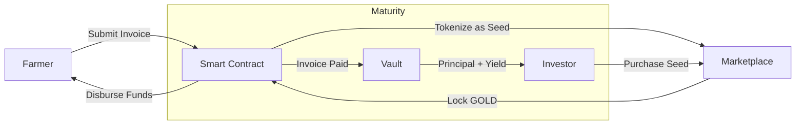
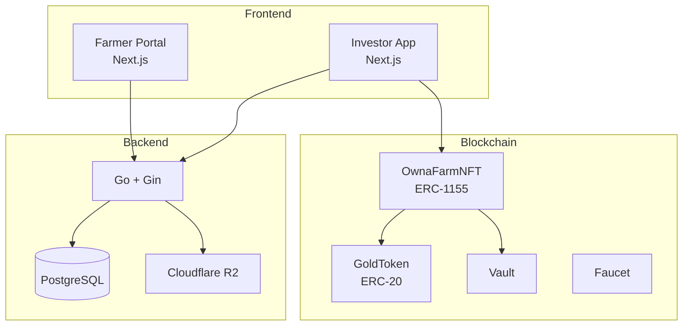

# OwnaFarm

**Gamified Invoice Financing for Agriculture on Mantle Network**

OwnaFarm transforms agricultural invoice financing into an engaging farming simulation. Farmers tokenize their invoices as "seeds" that investors can purchase, nurture, and harvest for returns.

---

## Overview



| Component           | Description                                     |
| ------------------- | ----------------------------------------------- |
| **Farmer Portal**   | Invoice submission and KYC registration         |
| **Investor App**    | Gamified interface for funding invoices         |
| **Smart Contracts** | On-chain invoice tokenization and settlement    |
| **Backend API**     | Game state, user management, and off-chain data |

---

## How It Works

**For Farmers:**

1. Register with KYC documentation
2. Submit invoice from verified offtaker
3. Receive funds when investors fund the invoice
4. Deliver goods, offtaker pays invoice

**For Investors:**

1. Connect wallet and acquire GOLD tokens
2. Browse marketplace for available "seeds"
3. Purchase seeds to fund invoices
4. Harvest principal + yield at maturity

---

## Architecture



---

## Smart Contracts

Deployed on **Mantle Sepolia Testnet** (Chain ID: 5003)

| Contract      | Address                                      |
| ------------- | -------------------------------------------- |
| GoldToken     | `0x787c8616d9b8Ccdca3B2b930183813828291dA9c` |
| GoldFaucet    | `0x5644F393a2480BE5E63731C30fCa81F9e80277a7` |
| OwnaFarmNFT   | `0xC51601dde25775bA2740EE14D633FA54e12Ef6C7` |
| OwnaFarmVault | `0x3b561Df673F08A566A09fEd718f5bdB8018C2CDa` |

[View on Mantle Explorer](https://sepolia.mantlescan.xyz)

---

## Tech Stack

| Layer          | Technologies                                            |
| -------------- | ------------------------------------------------------- |
| **Frontend**   | Next.js, TypeScript, Tailwind CSS, WAGMI, Framer Motion |
| **Backend**    | Go, Gin, GORM, PostgreSQL, Valkey                       |
| **Blockchain** | Solidity, Foundry, OpenZeppelin, Mantle L2              |
| **Storage**    | Cloudflare R2                                           |

---

## Repositories

| Repository                                                                       | Description               |
| -------------------------------------------------------------------------------- | ------------------------- |
| [OwnaFarm-contract](https://github.com/OwnaFarm/OwnaFarm-contract)               | Smart contracts (Foundry) |
| [Master-OwnaFarm-frontend](https://github.com/OwnaFarm/Master-OwnaFarm-frontend) | Farmer portal             |
| [investor-frontend](https://github.com/OwnaFarm/investor-frontend)               | Investor game app         |
| [ownafarm-backend](https://github.com/OwnaFarm/ownafarm-backend)                 | Backend API               |

---

## Quick Start

```bash
# Clone repositories
git clone https://github.com/OwnaFarm/OwnaFarm-contract
git clone https://github.com/OwnaFarm/Master-OwnaFarm-frontend
git clone https://github.com/OwnaFarm/investor-frontend
git clone https://github.com/OwnaFarm/ownafarm-backend

# Smart Contracts
cd OwnaFarm-contract
forge install && forge build

# Frontend (Farmer)
cd Master-OwnaFarm-frontend
pnpm install && pnpm dev

# Frontend (Investor)
cd investor-frontend
pnpm install && pnpm dev

# Backend
cd ownafarm-backend
go run cmd/api/main.go
```

---

## Documentation

Full documentation available at [docs.ownafarm.xyz](https://docs.ownafarm.xyz)

---

## License

MIT License

---

**Built by OwnaFarm Team**
