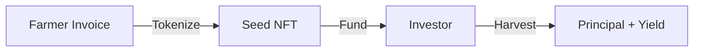

# OwnaFarm

**Where Real-World Assets Meet GameFi**

---

## What is OwnaFarm?

OwnaFarm is a blockchain-native platform that transforms agricultural invoice financing into an engaging farming simulation game. Built on Mantle Network L2, we bridge the critical $170 billion agricultural finance gap while delivering an unprecedented consumer experience for retail investors.

---

## Quick Links

| Resource             | Link                                                                                  |
| -------------------- | ------------------------------------------------------------------------------------- |
| **Live Application** | [ownafarm-farmer.vercel.app](https://ownafarm-farmer.vercel.app/)                     |
| **Pitch Deck**       | [View on Canva](https://www.canva.com/design/DAG-cxaLAeI/dgDXD1_EuUviUj2qUUMg4Q/view) |
| **Demo Video**       | [Watch on YouTube](https://youtu.be/D8RmfS-OOtw?si=Pl5rLKJDHvZ7mzvr)                  |
| **Smart Contracts**  | [Mantle Sepolia Explorer](https://sepolia.mantlescan.xyz)                             |

---

## The Core Transformation

| Traditional Finance | OwnaFarm         |
| ------------------- | ---------------- |
| Invoice document    | Virtual seed     |
| Investment          | Plant in garden  |
| Wait for maturity   | Watch plant grow |
| Receive returns     | Harvest crops    |

**Same financial outcome. Completely different experience.**

Investors interact with a game-like interface while funding real agricultural invoices. The complexity of invoice financing is abstracted into familiar farming game mechanics.

---

## Triple Innovation Stack

### 1. RWA Layer

Real agricultural invoices from verified offtakers tokenized as ERC-1155 NFTs on Mantle.

### 2. GameFi Layer

Complete farming simulation with XP progression, level tiers, daily engagement mechanics, and competitive leaderboards.

### 3. Transparency Layer

On-chain records and real-time CCTV farm monitoring provide complete visibility.

---

## Key Features

| Feature                  | Description                                           |
| ------------------------ | ----------------------------------------------------- |
| **Invoice Tokenization** | Real invoices become ERC-1155 NFTs on Mantle          |
| **Gamified Investing**   | Farming simulation with XP, levels, and daily rewards |
| **Transparency**         | On-chain records and CCTV farm monitoring             |
| **Low Fees**             | Mantle L2 enables micro-investments from $10          |

---

## Platform Statistics

| Metric         | Value                    |
| -------------- | ------------------------ |
| Network        | Mantle Sepolia (Testnet) |
| Token Standard | ERC-1155                 |
| Currency       | GOLD (ERC-20)            |
| Typical Yield  | 10-20%                   |
| Duration       | 30-180 days              |

---

## Smart Contracts

Deployed on **Mantle Sepolia Testnet** (Chain ID: 5003)

| Contract      | Address                                      |
| ------------- | -------------------------------------------- |
| GoldToken     | `0x787c8616d9b8Ccdca3B2b930183813828291dA9c` |
| GoldFaucet    | `0x5644F393a2480BE5E63731C30fCa81F9e80277a7` |
| OwnaFarmNFT   | `0xC51601dde25775bA2740EE14D633FA54e12Ef6C7` |
| OwnaFarmVault | `0x3b561Df673F08A566A09fEd718f5bdB8018C2CDa` |

---

## Documentation Sections

- [Problem Statement](introduction/problem.md)
- [Our Solution](introduction/solution.md)
- [How It Works](overview/how-it-works.md)
- [Smart Contracts](contracts/overview.md)
- [Gamification](features/gamification.md)
- [Transparency](features/transparency.md)
- [API Reference](technical/api-integration.md)

---

## Important Links

| Resource                | URL                                                                  |
| ----------------------- | -------------------------------------------------------------------- |
| **Pitch Deck**          | https://www.canva.com/design/DAG-cxaLAeI/dgDXD1_EuUviUj2qUUMg4Q/view |
| **Live Application**    | https://ownafarm-farmer.vercel.app/                                  |
| **Demo Video**          | https://youtu.be/D8RmfS-OOtw?si=Pl5rLKJDHvZ7mzvr                     |
| **GitHub Organization** | https://github.com/OwnaFarm                                          |

---

## OwnaFarm: Plant. Water. Harvest. Real Yields.

**Built for Mantle Hackathon 2026**

---

**Version:** 2.0.0  
**Updated:** January 2026
