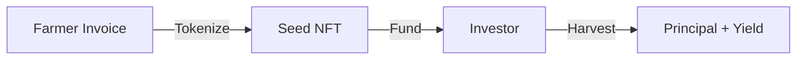

# OwnaFarm

**Gamified Invoice Financing for Agriculture**

---

## What is OwnaFarm?

OwnaFarm is a blockchain platform that transforms agricultural invoice financing into an engaging investment experience. Built on Mantle Network L2, it connects farmers seeking working capital with investors through a farming simulation game interface.

---

## The Concept

| Traditional Finance | OwnaFarm         |
| ------------------- | ---------------- |
| Invoice document    | Virtual seed     |
| Investment          | Plant in garden  |
| Wait for maturity   | Watch plant grow |
| Receive returns     | Harvest crops    |

Investors interact with a game-like interface while funding real agricultural invoices. The complexity of invoice financing is abstracted into familiar farming game mechanics.

---

## Key Features

| Feature                  | Description                                           |
| ------------------------ | ----------------------------------------------------- |
| **Invoice Tokenization** | Real invoices become ERC-1155 NFTs on Mantle          |
| **Gamified Investing**   | Farming simulation with XP, levels, and daily rewards |
| **Transparency**         | On-chain records and CCTV farm monitoring             |
| **Low Fees**             | Mantle L2 enables micro-investments                   |

---

## Platform Statistics

| Metric         | Value                    |
| -------------- | ------------------------ |
| Network        | Mantle Sepolia (Testnet) |
| Token Standard | ERC-1155                 |
| Currency       | GOLD (ERC-20)            |
| Typical Yield  | 10-20%                   |
| Duration       | 30-180 days              |

---

## Quick Links

- [How It Works](overview/how-it-works.md)
- [Smart Contracts](contracts/overview.md)
- [API Reference](technical/api-integration.md)

---

**Version:** 2.0.0  
**Updated:** January 2026
