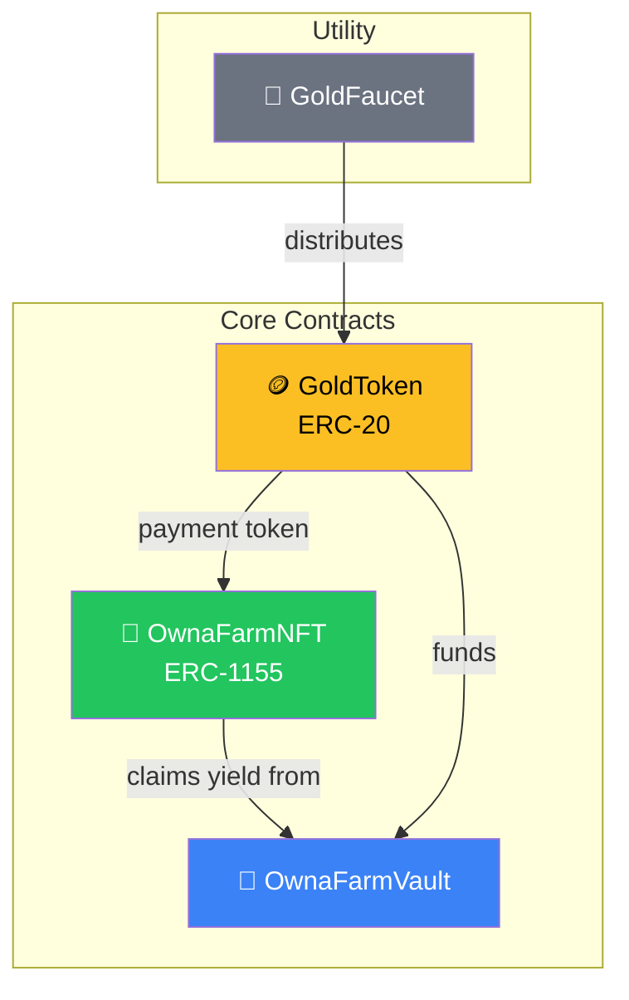
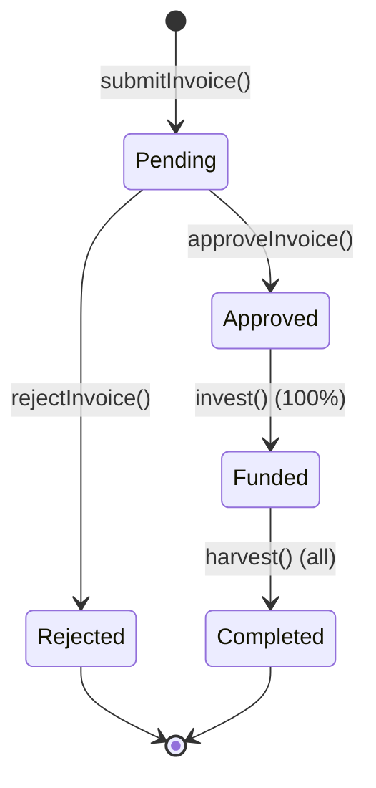

# Contract Overview

## Smart Contract Architecture

OwnaFarm's smart contracts form the trustless backbone of the platform, handling all financial transactions and asset management.

---

## Contract Ecosystem



---

## Contract Summaries

### GoldToken (ERC-20)

The platform's native currency.

| Property           | Value            |
| ------------------ | ---------------- |
| **Standard**       | ERC-20           |
| **Name**           | OwnaFarm Gold    |
| **Symbol**         | GOLD             |
| **Decimals**       | 18               |
| **Initial Supply** | 100,000,000 GOLD |

**Purpose**: All investments, payments, and rewards use GOLD.

---

### GoldFaucet

Testnet token distribution system.

| Feature          | Value                  |
| ---------------- | ---------------------- |
| **Claim Amount** | 10,000 GOLD            |
| **Cooldown**     | 24 hours               |
| **Purpose**      | Testing and onboarding |

**Purpose**: Provides free GOLD tokens for platform testing.

---

### OwnaFarmNFT (ERC-1155)

The main contract managing invoices and investments.

| Feature         | Description          |
| --------------- | -------------------- |
| **Standard**    | ERC-1155 Multi-Token |
| **Invoices**    | Tokenized as NFTs    |
| **Investments** | Tracked per investor |
| **Settlement**  | Automated harvest    |

**Purpose**: Core logic for invoice submission, investment, and claims.

---

### OwnaFarmVault

Yield reserve and treasury management.

| Feature        | Description          |
| -------------- | -------------------- |
| **Role**       | Store yield reserves |
| **Funding**    | Admin deposits GOLD  |
| **Withdrawal** | Only by OwnaFarmNFT  |

**Purpose**: Ensures yield payments are always available.

---

## Security Model

### Access Control

```
Owner (Deployer)
├── GoldToken: mint()
├── GoldFaucet: setClaimAmount(), setCooldownTime()
└── OwnaFarmVault: depositYield(), emergencyWithdraw()

Admin Role
├── OwnaFarmNFT: approveInvoice(), rejectInvoice()
└── OwnaFarmVault: depositYield()

Public
├── GoldFaucet: claim()
├── OwnaFarmNFT: submitInvoice(), invest(), harvest()
└── All read functions
```

### Contract Relationships

| Contract      | Trusts      | For                   |
| ------------- | ----------- | --------------------- |
| GoldFaucet    | GoldToken   | Distributing GOLD     |
| OwnaFarmNFT   | GoldToken   | Accepting investments |
| OwnaFarmVault | OwnaFarmNFT | Yield withdrawals     |

---

## Invoice Status Flow



| Status    | Code | Can Invest | Can Harvest         |
| --------- | ---- | ---------- | ------------------- |
| Pending   | 0    | ❌         | ❌                  |
| Approved  | 1    | ✅         | ❌                  |
| Rejected  | 2    | ❌         | ❌                  |
| Funded    | 3    | ❌         | ✅ (after maturity) |
| Completed | 4    | ❌         | ❌                  |

---

## Token Economics

### GOLD Flow

```
               ┌─────────────┐
               │   Faucet    │
               │  (Testing)  │
               └──────┬──────┘
                      │ claim()
                      ▼
┌─────────┐    ┌─────────────┐    ┌─────────────┐
│ Investor│───►│  GoldToken  │◄───│   Farmer    │
└────┬────┘    └──────┬──────┘    └─────────────┘
     │                │
     │ invest()       │ harvest()
     ▼                │
┌─────────────┐       │
│ OwnaFarmNFT │◄──────┘
└──────┬──────┘
       │ withdrawYield()
       ▼
┌─────────────┐
│OwnaFarmVault│
└─────────────┘
```

### Investment Math

```
Principal = Investment amount
Yield = Principal × (yieldBps / 10000)
Total Return = Principal + Yield

Example:
Principal = 1000 GOLD
yieldBps = 1500 (15%)
Yield = 1000 × (1500 / 10000) = 150 GOLD
Total Return = 1150 GOLD
```

---

## Development Info

| Item          | Detail                   |
| ------------- | ------------------------ |
| **Framework** | Foundry                  |
| **Language**  | Solidity ^0.8.20         |
| **Network**   | Mantle Sepolia (Testnet) |
| **Chain ID**  | 5003                     |

---

## Next: [Deployed Addresses →](addresses.md)
