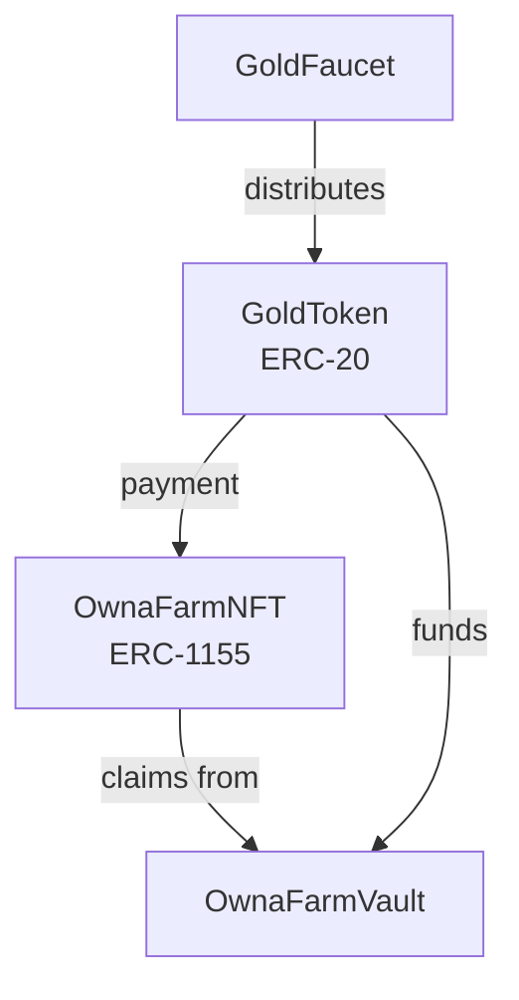
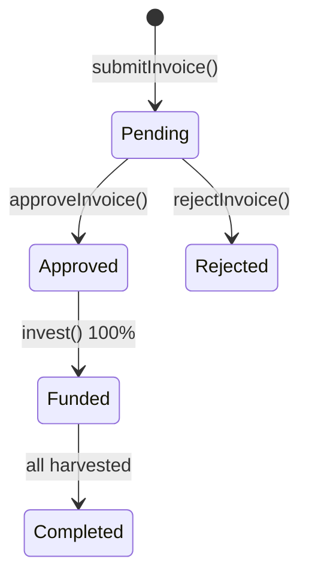

# Contract Overview

## Smart Contract Architecture

OwnaFarm smart contracts form the trustless backbone handling all financial transactions.

---

## Contract Ecosystem



---

## Contract Summary

### GoldToken (ERC-20)

Platform currency for all transactions.

| Property       | Value         |
| -------------- | ------------- |
| Name           | OwnaFarm Gold |
| Symbol         | GOLD          |
| Decimals       | 18            |
| Initial Supply | 100,000,000   |

### GoldFaucet

Testnet token distribution.

| Property     | Value       |
| ------------ | ----------- |
| Claim Amount | 10,000 GOLD |
| Cooldown     | 24 hours    |

### OwnaFarmNFT (ERC-1155)

Core contract for invoices and investments.

| Feature             | Description                 |
| ------------------- | --------------------------- |
| Invoice submission  | Farmers submit for approval |
| Investment tracking | Per-investor records        |
| Harvest settlement  | Automated claims            |

### OwnaFarmVault

Yield reserve management.

| Feature       | Description             |
| ------------- | ----------------------- |
| Yield deposit | Admin deposits reserves |
| Withdrawal    | Only by OwnaFarmNFT     |
| Emergency     | Owner recovery function |

---

## Invoice Status Flow



| Status    | Code | Can Invest | Can Harvest          |
| --------- | ---- | ---------- | -------------------- |
| Pending   | 0    | No         | No                   |
| Approved  | 1    | Yes        | No                   |
| Rejected  | 2    | No         | No                   |
| Funded    | 3    | No         | Yes (after maturity) |
| Completed | 4    | No         | No                   |

---

## Access Control

```
Owner (Deployer)
  - GoldToken: mint()
  - GoldFaucet: setClaimAmount(), setCooldown()
  - OwnaFarmVault: emergencyWithdraw()

Admin Role
  - OwnaFarmNFT: approveInvoice(), rejectInvoice()
  - OwnaFarmVault: depositYield()

Public
  - GoldFaucet: claim()
  - OwnaFarmNFT: submitInvoice(), invest(), harvest()
```

---

## Yield Calculation

```
Principal = Investment amount
Yield = Principal x (yieldBps / 10000)
Total Return = Principal + Yield

Example:
Principal = 1000 GOLD
yieldBps = 1500 (15%)
Yield = 1000 x (1500 / 10000) = 150 GOLD
Total = 1150 GOLD
```

---

## Development

| Item      | Detail           |
| --------- | ---------------- |
| Framework | Foundry          |
| Language  | Solidity ^0.8.24 |
| Network   | Mantle Sepolia   |
| Chain ID  | 5003             |

---

[Next: Deployed Addresses](addresses.md)
