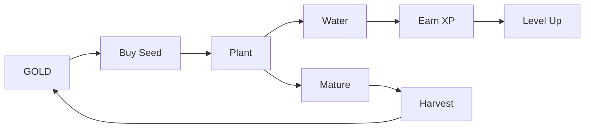

# Gamification

## Making Investing Engaging

OwnaFarm transforms invoice financing into a farming simulation game experience.

---

## Core Concept

| Traditional        | OwnaFarm           |
| ------------------ | ------------------ |
| Charts and numbers | Growing plants     |
| Wait for returns   | Daily interactions |
| Set and forget     | Play and earn      |

---

## Game Loop

---

## Mechanics

### Seeds = Investments

| Traditional       | Game             |
| ----------------- | ---------------- |
| Invoice purchase  | Buy seed         |
| Investment amount | Seed price       |
| Yield rate        | Growth potential |
| Maturity date     | Harvest time     |

### Watering = Engagement

| Action       | Effect         |
| ------------ | -------------- |
| Water plant  | Earn XP        |
| Check growth | Track progress |
| View CCTV    | See real farm  |

### Harvest = Returns

| Action         | Result               |
| -------------- | -------------------- |
| Harvest button | Claim smart contract |
| Receive crop   | Principal + yield    |
| XP bonus       | Level progression    |

---

## Progression System

### Experience Points

| Activity            | XP   |
| ------------------- | ---- |
| First seed purchase | +100 |
| Daily watering      | +10  |
| Complete harvest    | +50  |
| Referral            | +200 |

### Level Tiers

| Level | XP Required | Unlocks      |
| ----- | ----------- | ------------ |
| 1     | 0           | Basic seeds  |
| 5     | 500         | Medium-yield |
| 10    | 2,000       | High-yield   |
| 20    | 10,000      | Premium      |
| 50    | 50,000      | VIP benefits |

---

## Resources

### GOLD (Currency)

| Source  | Method               |
| ------- | -------------------- |
| Faucet  | Free claim (testnet) |
| Harvest | Collect profits      |
| Trade   | Convert from assets  |

### Water Points

| Property       | Value      |
| -------------- | ---------- |
| Maximum        | 100 points |
| Regeneration   | 20/day     |
| Cost per water | 10 points  |

---

## Visual Features

| View        | Purpose                                 |
| ----------- | --------------------------------------- |
| Garden      | Isometric display of active investments |
| Marketplace | Browse available seeds                  |
| Leaderboard | Compete with other investors            |
| Profile     | Track stats and achievements            |

---

## Game-Finance Mapping

| Game        | Finance                 |
| ----------- | ----------------------- |
| Seed        | Tokenized invoice       |
| Planting    | Investment transaction  |
| Growth time | Maturity period         |
| Watering    | Engagement              |
| Harvest     | Principal + yield claim |
| GOLD        | Platform currency       |
| Level       | Investment tier access  |

---

[Next: Transparency](transparency.md)
