# Gamification

## Making Investing Fun

OwnaFarm transforms the boring experience of invoice financing into an engaging farming simulation game.

---

## The Game Philosophy

```
Traditional Investing          OwnaFarm
━━━━━━━━━━━━━━━━━━━━          ━━━━━━━━━━━━━━
📊 Charts and numbers   →     🌱 Growing plants
📈 Wait for returns     →     💧 Daily interactions
❌ Set and forget       →     🎮 Play and earn
😴 Boring               →     🎉 Engaging
```

**Why Gamification Works:**

- Reduces perceived complexity
- Creates emotional connection to investments
- Encourages regular platform engagement
- Makes financial education enjoyable

---

## Core Game Mechanics

### 🌱 Seeds = Investments

| Traditional       | Game Equivalent  |
| ----------------- | ---------------- |
| Invoice Purchase  | Buy a Seed       |
| Investment Amount | Seed Price       |
| Yield Rate        | Growth Potential |
| Maturity Date     | Harvest Time     |

### 💧 Watering = Engagement

Daily interactions with your investments:

| Action           | Effect         |
| ---------------- | -------------- |
| Water your plant | Earn XP        |
| Check growth     | Track progress |
| View CCTV        | See real farm  |

### 🌾 Harvest = Returns

When the invoice matures:

| Game Action      | Financial Reality    |
| ---------------- | -------------------- |
| "Harvest" button | Claim smart contract |
| Receive crop     | Principal + Yield    |
| XP bonus         | Level progression    |

---

## The Game Loop

```mermaid
flowchart LR
    A[🪙 GOLD] -->|Buy| B[🌱 Seed]
    B -->|Plant| C[🌿 Growing]
    C -->|Daily| D[💧 Water]
    D -->|Earn| E[⭐ XP]
    E -->|Level Up| F[🎖️ Tier]
    C -->|Mature| G[🌾 Ready]
    G -->|Claim| H[💰 Harvest]
    H -->|More GOLD| A

    style A fill:#fbbf24,color:#000
    style B fill:#22c55e,color:#fff
    style C fill:#84cc16,color:#000
    style D fill:#3b82f6,color:#fff
    style E fill:#a855f7,color:#fff
    style F fill:#f97316,color:#fff
    style G fill:#f59e0b,color:#fff
    style H fill:#fbbf24,color:#000
```



---

## Progression System

### Experience Points (XP)

| Activity            | XP Earned |
| ------------------- | --------- |
| First seed purchase | +100 XP   |
| Daily watering      | +10 XP    |
| Complete harvest    | +50 XP    |
| Referral bonus      | +200 XP   |

### Level Tiers

| Level | XP Required | Unlocks            |
| ----- | ----------- | ------------------ |
| 1     | 0           | Basic seeds        |
| 5     | 500         | Medium-yield seeds |
| 10    | 2,000       | High-yield seeds   |
| 20    | 10,000      | Premium seeds      |
| 50    | 50,000      | VIP benefits       |

### Benefits of Leveling

| Benefit             | Description                   |
| ------------------- | ----------------------------- |
| **Higher Yields**   | Access to premium invoices    |
| **Priority Access** | Early access to limited seeds |
| **Lower Minimums**  | Smaller investment thresholds |
| **Special Seeds**   | Exclusive crop types          |

---

## In-Game Resources

### 🪙 GOLD (Currency)

The platform's primary token used for all transactions.

| Source  | Method                    |
| ------- | ------------------------- |
| Faucet  | Claim free GOLD (testnet) |
| Harvest | Collect profits           |
| Trade   | Convert from other assets |

### 💧 Water Points

Resource for daily plant interactions.

| Property          | Value         |
| ----------------- | ------------- |
| Maximum           | 100 points    |
| Regeneration      | 20 points/day |
| Cost per watering | 10 points     |

---

## Visual Experience

### Garden View

Your personal isometric farm displaying:

- All active investments as growing plants
- Progress bars showing maturity
- Ready-to-harvest indicators
- Daily interaction prompts

### Marketplace

Browse available seeds with:

- Crop type and image
- Offtaker logo
- Yield percentage
- Duration countdown
- Funding progress

### Leaderboard

Compete with other investors:

- Total harvests
- XP rankings
- Achievement badges
- Monthly competitions

---

## Gamification Benefits

| For Users          | For Platform      |
| ------------------ | ----------------- |
| Fun experience     | Higher engagement |
| Clear progress     | Better retention  |
| Social elements    | Viral growth      |
| Achievement system | User loyalty      |
| Daily rewards      | Regular visits    |

---

## Game-Finance Mapping

| Game Concept | Financial Reality       |
| ------------ | ----------------------- |
| Seed         | Tokenized invoice       |
| Planting     | Investment transaction  |
| Growth time  | Invoice maturity period |
| Watering     | Platform engagement     |
| Harvest      | Principal + yield claim |
| GOLD         | Platform stablecoin     |
| Level        | Investment tier access  |

---

## Next: [Transparency & Trust →](transparency.md)
