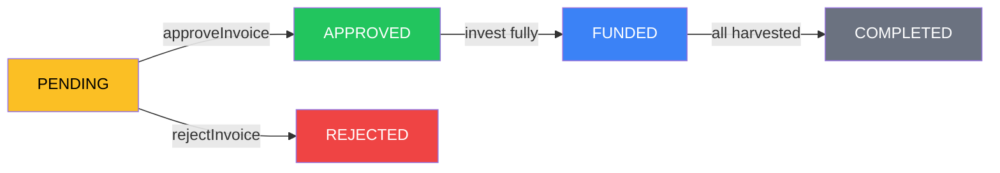

# Invoice Tokenization

## Turning Contracts Into Digital Assets

Invoice tokenization is the core mechanism that enables OwnaFarm to provide farmers with instant liquidity.

---

## What Is Invoice Tokenization?

```
📄 Real Invoice → ⛓️ Smart Contract → 🎟️ NFT Token → 💰 Tradeable Asset
```

When a farmer submits an invoice:

1. The invoice details are recorded on-chain
2. An ERC-1155 NFT is minted representing the invoice
3. Investors can purchase fractional ownership
4. Upon maturity, token holders claim their share

---

## Why Tokenize Invoices?

### Traditional Invoice Financing

| Step                  | Duration   | Friction       |
| --------------------- | ---------- | -------------- |
| Submit to bank        | Day 1      | Paperwork      |
| Credit assessment     | Days 1-14  | Waiting        |
| Collateral evaluation | Days 14-30 | More paperwork |
| Approval decision     | Day 30+    | Uncertainty    |
| Fund disbursement     | Days 30-60 | More waiting   |

### Tokenized Invoice Financing

| Step            | Duration      | Experience                   |
| --------------- | ------------- | ---------------------------- |
| Submit on-chain | Instant       | One transaction              |
| Admin review    | 24-48 hours   | Transparent status           |
| Listing         | Instant       | Available to investors       |
| Funding         | Hours to days | Market-driven                |
| Disbursement    | Instant       | Automatic via smart contract |

---

## Benefits of Tokenization

### For Farmers

| Benefit           | Description                    |
| ----------------- | ------------------------------ |
| **Speed**         | Funding in hours, not months   |
| **Access**        | No bank account requirements   |
| **Fair Rates**    | Market-determined pricing      |
| **Transparency**  | Know exactly who funded you    |
| **No Collateral** | Invoice itself is the security |

### For Investors

| Benefit                  | Description                        |
| ------------------------ | ---------------------------------- |
| **Fractional Ownership** | Invest any amount                  |
| **Diversification**      | Spread across multiple invoices    |
| **Liquidity**            | NFTs are transferable              |
| **Transparency**         | Full visibility into invoice terms |
| **Automation**           | Smart contract handles settlement  |

---

## Invoice Lifecycle On-Chain



| Status        | Code | Description                      | Next Actions      |
| ------------- | ---- | -------------------------------- | ----------------- |
| **Pending**   | 0    | Newly submitted, awaiting review | Approve or Reject |
| **Approved**  | 1    | Ready for investment             | Invest            |
| **Rejected**  | 2    | Did not pass review              | None (final)      |
| **Funded**    | 3    | Fully funded by investors        | Wait for maturity |
| **Completed** | 4    | All investors have harvested     | None (final)      |

---

## Invoice Data Structure

Each tokenized invoice contains:

| Field          | Type    | Description                      |
| -------------- | ------- | -------------------------------- |
| `farmer`       | address | Wallet of the invoice submitter  |
| `offtakerId`   | bytes32 | Identifier of the buyer          |
| `targetFund`   | uint128 | Total amount to raise            |
| `fundedAmount` | uint128 | Current amount funded            |
| `yieldBps`     | uint16  | Yield in basis points (100 = 1%) |
| `duration`     | uint32  | Lock period in seconds           |
| `createdAt`    | uint32  | Submission timestamp             |
| `status`       | uint8   | Current invoice status           |

---

## Fractional Investment Model

```
Invoice: $10,000 Target
├── Investor A: $2,000 (20%)
├── Investor B: $3,000 (30%)
├── Investor C: $5,000 (50%)
└── Total: $10,000 (100% Funded)

Each investor receives:
- 1 NFT token (quantity based on share)
- Proportional yield upon harvest
```

### Investment Example

| Investor | Amount | Ownership | Yield (15%) | Total Return |
| -------- | ------ | --------- | ----------- | ------------ |
| A        | $2,000 | 20%       | $300        | $2,300       |
| B        | $3,000 | 30%       | $450        | $3,450       |
| C        | $5,000 | 50%       | $750        | $5,750       |

---

## Security Guarantees

| Layer                    | Protection                            |
| ------------------------ | ------------------------------------- |
| **Smart Contract**       | All funds locked until conditions met |
| **ERC-1155 Standard**    | Proven, audited token implementation  |
| **Immutable Records**    | Cannot alter invoice after submission |
| **Automatic Settlement** | No manual intervention required       |

---

## Next: [Gamification →](gamification.md)
