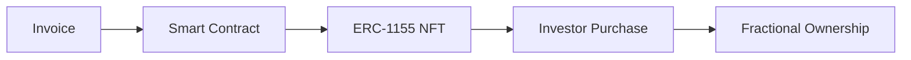
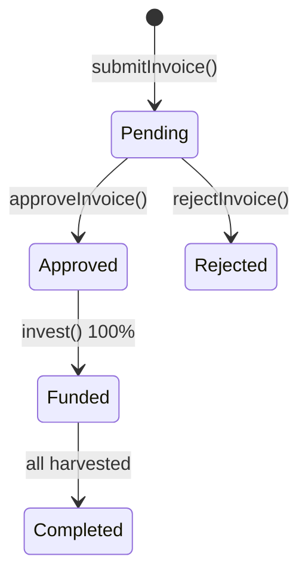

# Invoice Tokenization

## Converting Invoices to Digital Assets

Invoice tokenization enables farmers to receive instant liquidity by converting real-world invoices into blockchain assets.

---

## Process



When a farmer submits an invoice:

1. Details recorded on-chain
2. ERC-1155 NFT minted
3. Investors purchase fractional ownership
4. Token holders claim share at maturity

---

## Benefits

### For Farmers

| Benefit       | Description                  |
| ------------- | ---------------------------- |
| Speed         | Funding in hours, not months |
| Access        | No bank account requirements |
| Fair rates    | Market-determined pricing    |
| No collateral | Invoice is the security      |

### For Investors

| Benefit              | Description                |
| -------------------- | -------------------------- |
| Fractional ownership | Invest any amount          |
| Diversification      | Spread across invoices     |
| Transparency         | Full visibility into terms |
| Automation           | Smart contract settlement  |

---

## Invoice Lifecycle



| Status    | Code | Description           |
| --------- | ---- | --------------------- |
| Pending   | 0    | Awaiting admin review |
| Approved  | 1    | Open for investment   |
| Rejected  | 2    | Did not pass review   |
| Funded    | 3    | Fully funded          |
| Completed | 4    | All claims processed  |

---

## Invoice Structure

| Field        | Type    | Description           |
| ------------ | ------- | --------------------- |
| farmer       | address | Invoice submitter     |
| offtakerId   | bytes32 | Buyer identifier      |
| targetFund   | uint128 | Amount to raise       |
| fundedAmount | uint128 | Current amount funded |
| yieldBps     | uint16  | Yield in basis points |
| duration     | uint32  | Lock period (seconds) |
| status       | uint8   | Current status        |

---

## Investment Example

```
Invoice: $10,000 Target, 15% Yield

Investor A: $2,000 (20%)  ->  Return: $2,300
Investor B: $3,000 (30%)  ->  Return: $3,450
Investor C: $5,000 (50%)  ->  Return: $5,750
```

Each investor receives an NFT and proportional yield.

---

## Security

| Layer          | Protection                        |
| -------------- | --------------------------------- |
| Smart Contract | Funds locked until conditions met |
| ERC-1155       | Audited token implementation      |
| Immutable      | Cannot alter after submission     |
| Automatic      | No manual intervention            |

---

[Next: Gamification](gamification.md)
