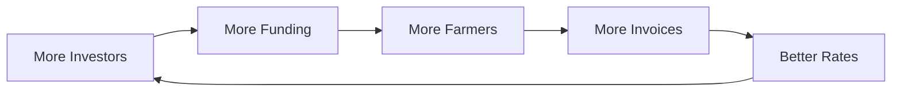

# Our Solution

## Gamified Invoice Tokenization

OwnaFarm bridges the financing gap through three innovations:

1. **Invoice Tokenization** - Real invoices become blockchain assets
2. **Gamification** - Investing feels like playing a farming game
3. **Blockchain Transparency** - All transactions are verifiable on-chain

---

## Invoice as Game Asset

| Traditional          | OwnaFarm                      |
| -------------------- | ----------------------------- |
| Invoice #12345       | Indofood Chili Seed           |
| 15% APR, 90-day term | 15% yield, harvest in 90 days |
| Click to invest      | Plant in your garden          |
| Wait for maturity    | Water daily, earn XP          |
| Receive returns      | Harvest your crops            |

Same financial outcome. Different user experience.

---

## Value Creation

### For Farmers

| Benefit       | Description                    |
| ------------- | ------------------------------ |
| Speed         | Funding in days, not months    |
| Access        | No traditional credit required |
| Fair rates    | Market-driven pricing          |
| No collateral | Invoice is the security        |

### For Investors

| Benefit            | Description                         |
| ------------------ | ----------------------------------- |
| Real asset backing | Investment tied to actual contracts |
| Attractive yields  | 10-20% with short durations         |
| Low minimums       | Start with small amounts            |
| Engagement         | Game mechanics maintain interest    |

---

## The Flywheel

Network effects strengthen the platform over time.

---

## Technical Foundation

| Feature        | Implementation                          |
| -------------- | --------------------------------------- |
| Layer 2        | Mantle Network for low fees             |
| Modular        | Separate farmer and investor interfaces |
| API-First      | Easy integration with existing systems  |
| Multi-Offtaker | Any verified buyer can participate      |

---

[Next: How It Works](../overview/how-it-works.md)
