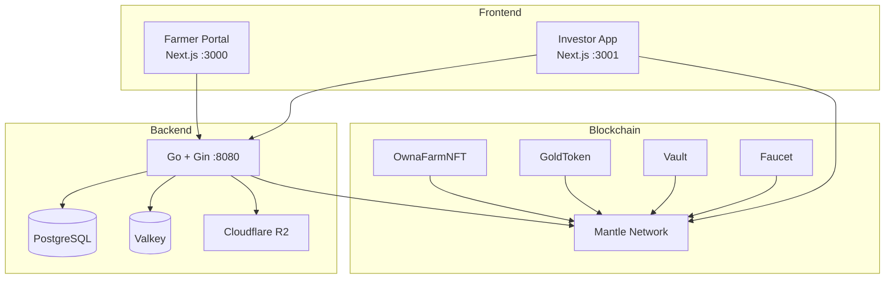

# System Architecture

## Overview

OwnaFarm consists of three layers: Frontend, Backend, and Blockchain.



---

## Frontend Layer

### Farmer Portal

| Route            | Function                       |
| ---------------- | ------------------------------ |
| `/`              | Landing page                   |
| `/register-farm` | Multi-step farmer registration |
| `/admin`         | Invoice management             |

### Investor App

| Route          | Function                   |
| -------------- | -------------------------- |
| `/`            | Homepage with active crops |
| `/shop`        | Seed marketplace           |
| `/farm`        | Personal garden view       |
| `/leaderboard` | Investor rankings          |
| `/profile`     | User stats                 |

---

## Backend Layer

### Responsibilities

| Area             | Function                      |
| ---------------- | ----------------------------- |
| User Management  | Profiles, authentication, KYC |
| Game State       | XP, levels, water points      |
| Document Storage | Farmer documents to R2        |
| Event Indexing   | Sync blockchain events        |

### Data Stores

| Store         | Purpose              |
| ------------- | -------------------- |
| PostgreSQL    | Primary database     |
| Valkey        | Caching and sessions |
| Cloudflare R2 | Document storage     |

---

## Blockchain Layer

### Smart Contracts

| Contract      | Standard | Purpose              |
| ------------- | -------- | -------------------- |
| GoldToken     | ERC-20   | Platform currency    |
| GoldFaucet    | -        | Testnet distribution |
| OwnaFarmNFT   | ERC-1155 | Invoice tokens       |
| OwnaFarmVault | -        | Yield reserve        |

### Why Mantle

| Feature        | Benefit             |
| -------------- | ------------------- |
| Layer 2        | Low gas fees        |
| EVM Compatible | Standard tooling    |
| Fast Finality  | Quick confirmations |

---

## Data Distribution

| Data Type       | Location      | Reason               |
| --------------- | ------------- | -------------------- |
| Financial state | Blockchain    | Immutable, trustless |
| User identity   | Database      | Privacy, compliance  |
| Game mechanics  | Database      | Flexibility          |
| Documents       | Cloud storage | Size, access         |

---

## Communication Patterns

### Frontend to Backend

```
REST API (JSON)
POST /api/farmers/register
GET  /api/user/profile
POST /api/game/water
```

### Frontend to Blockchain

```
WAGMI/Viem (RPC)
READ:  getAvailableInvoices()
WRITE: invest(), harvest()
```

### Backend to Blockchain

```
go-ethereum (RPC)
Event listening
Transaction submission
```

---

[Next: User Roles](user-roles.md)
