# System Architecture

## High-Level Overview

OwnaFarm consists of three main layers working together:

```mermaid
graph TB
    subgraph "👥 User Layer"
        F[👨‍🌾 Farmer Portal<br/>Next.js]
        I[🎮 Investor App<br/>Next.js]
    end

    subgraph "⚙️ Application Layer"
        BE[🔧 Backend API<br/>Go + Gin]
        DB[(PostgreSQL)]
        CACHE[(Valkey/Redis)]
        S3[☁️ Cloudflare R2]
    end

    subgraph "⛓️ Blockchain Layer"
        NFT[🎨 OwnaFarmNFT<br/>ERC-1155]
        GOLD[🪙 GoldToken<br/>ERC-20]
        VAULT[🏦 Vault]
        FAUCET[🚰 Faucet]
        MANTLE[Mantle Network]
    end

    F --> BE
    I --> BE
    I --> MANTLE

    BE --> DB
    BE --> CACHE
    BE --> S3
    BE --> MANTLE

    NFT --> MANTLE
    GOLD --> MANTLE
    VAULT --> MANTLE
    FAUCET --> MANTLE

    style F fill:#22c55e,color:#fff
    style I fill:#3b82f6,color:#fff
    style BE fill:#f97316,color:#fff
    style MANTLE fill:#a855f7,color:#fff
```



---

## Frontend Layer

### Farmer Portal (`Master-OwnaFarm-frontend`)

**Purpose**: Registration and invoice submission for farmers

| Page             | Function                        |
| ---------------- | ------------------------------- |
| `/`              | Landing page with platform info |
| `/register-farm` | Multi-step farmer registration  |

**Key Features**:

- KYC document upload
- Invoice submission form
- Status tracking dashboard

### Investor App (`investor-frontend`)

**Purpose**: Gamified investment interface

| Page           | Function                   |
| -------------- | -------------------------- |
| `/`            | Homepage with active crops |
| `/shop`        | Seed marketplace           |
| `/farm`        | Personal garden view       |
| `/leaderboard` | Investor rankings          |
| `/profile`     | User stats and settings    |

**Key Features**:

- Wallet connection (WAGMI + Privy)
- Game mechanics (watering, XP)
- Real-time portfolio tracking

---

## Backend Layer

### API Server (Go + Gin)

Handles off-chain logic and data:

| Responsibility       | Details                       |
| -------------------- | ----------------------------- |
| **User Management**  | Profiles, authentication, KYC |
| **Game State**       | XP, levels, water points      |
| **Document Storage** | Farmer documents to R2        |
| **Event Indexing**   | Sync blockchain events        |
| **CCTV Integration** | Farm monitoring links         |

### Data Stores

| Store             | Purpose                           |
| ----------------- | --------------------------------- |
| **PostgreSQL**    | Primary database for all entities |
| **Valkey**        | Caching and session management    |
| **Cloudflare R2** | Document and image storage        |

---

## Blockchain Layer

### Smart Contracts on Mantle

| Contract          | Standard | Purpose                           |
| ----------------- | -------- | --------------------------------- |
| **GoldToken**     | ERC-20   | Platform currency                 |
| **GoldFaucet**    | -        | Testnet token distribution        |
| **OwnaFarmNFT**   | ERC-1155 | Invoice tokens + investment logic |
| **OwnaFarmVault** | -        | Yield reserve storage             |

### Why Mantle Network?

| Feature               | Benefit                        |
| --------------------- | ------------------------------ |
| **Layer 2**           | Low gas fees (~$0.01 per tx)   |
| **EVM Compatible**    | Standard Solidity tooling      |
| **Fast Finality**     | Quick transaction confirmation |
| **Growing Ecosystem** | DeFi integrations available    |

---

## Data Distribution

### What Lives Where

```mermaid
graph LR
    subgraph "📁 Database"
        D1[User Profiles]
        D2[Farmer KYC Data]
        D3[Game Progress]
        D4[Transaction Logs]
    end

    subgraph "⛓️ Blockchain"
        B1[Invoice NFTs]
        B2[Investment Records]
        B3[GOLD Balances]
        B4[Claim Status]
    end

    subgraph "☁️ Storage"
        S1[ID Documents]
        S2[Invoice Files]
        S3[Farm Photos]
    end
```



| Data Type           | Location      | Reason                   |
| ------------------- | ------------- | ------------------------ |
| **Financial State** | Blockchain    | Immutable, trustless     |
| **User Identity**   | Database      | Privacy, compliance      |
| **Game Mechanics**  | Database      | Flexibility, performance |
| **Documents**       | Cloud Storage | Size, accessibility      |

---

## Communication Patterns

### Frontend ↔ Backend

```
REST API (JSON)
├── POST /api/farmers/register
├── GET  /api/user/profile
├── POST /api/game/water
└── GET  /api/crops/:id/cctv
```

### Frontend ↔ Blockchain

```
WAGMI/Viem (RPC)
├── READ:  getAvailableInvoices()
├── READ:  balanceOf()
├── WRITE: approve()
├── WRITE: invest()
└── WRITE: harvest()
```

### Backend ↔ Blockchain

```
go-ethereum (RPC)
├── Event Listening
├── Transaction Submission
└── State Queries
```

---

## Next: [User Roles →](user-roles.md)
