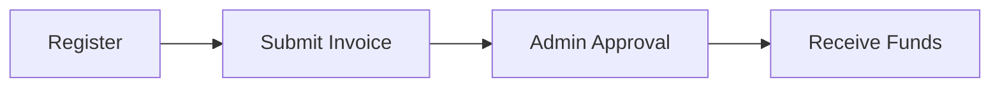
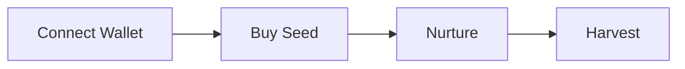
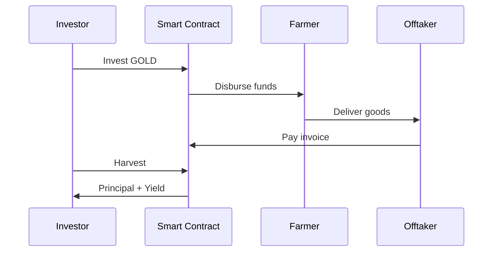

# How It Works

## Complete User Journey

---

## Farmer Flow

### Step 1: Register

Complete KYC verification with personal ID, business documents, and bank details.

### Step 2: Submit Invoice

Upload offtaker contract with funding target, yield percentage, and duration.

### Step 3: Get Approved

Platform administrators verify invoice authenticity and offtaker credibility.

### Step 4: Receive Funds

Once fully funded, GOLD tokens transfer to farmer wallet.

---

## Investor Flow

### Step 1: Connect Wallet

Link Web3 wallet and claim GOLD from faucet (testnet).

### Step 2: Buy Seed

Browse marketplace, view yield and duration, purchase with GOLD tokens.

### Step 3: Nurture

Water plants daily for XP, track growth progress, level up profile.

### Step 4: Harvest

When invoice matures, claim principal plus yield.

---

## Investment Lifecycle

| Phase    | Duration    | Action         | Result                     |
| -------- | ----------- | -------------- | -------------------------- |
| Purchase | Instant     | Buy seed       | NFT minted, funds locked   |
| Growing  | 1-180 days  | Water, earn XP | Contract executes          |
| Maturity | End of term | Wait           | Invoice paid               |
| Harvest  | Instant     | Claim          | Principal + yield returned |

---

## Fund Flow

---

## Safety Mechanisms

| Layer                 | Protection                    |
| --------------------- | ----------------------------- |
| Offtaker verification | Only approved buyers accepted |
| Invoice validation    | Admin review before listing   |
| Vault reserve         | Yield funds pre-deposited     |
| Smart contract        | Automated settlement          |
| Blockchain record     | Immutable transaction history |

---

[Next: System Architecture](architecture.md)
