# How It Works

## The Complete Journey

OwnaFarm connects farmers and investors through a seamless, game-like experience powered by blockchain technology.

---

## For Farmers: Submit to Funded in 4 Steps

```mermaid
flowchart LR
    A[📝 Register] --> B[📄 Submit Invoice]
    B --> C[✅ Get Approved]
    C --> D[💰 Receive Funds]

    style A fill:#22c55e,color:#fff
    style B fill:#3b82f6,color:#fff
    style C fill:#a855f7,color:#fff
    style D fill:#f59e0b,color:#fff
```



### Step 1: Register

Complete KYC verification with:

- Personal identification (ID card)
- Business documentation
- Bank account details
- Farm/business proof

### Step 2: Submit Invoice

Upload your offtaker contract:

- Select buyer (offtaker)
- Set funding target amount
- Define yield percentage for investors
- Specify contract duration

### Step 3: Get Approved

Platform administrators verify:

- Invoice authenticity
- Offtaker credibility
- Terms reasonableness

### Step 4: Receive Funds

Once investors fully fund your invoice:

- GOLD tokens deposited to your wallet
- Convert to local currency via platform
- Use funds for farm operations

---

## For Investors: Play, Grow, Earn

```mermaid
flowchart LR
    A[🔗 Connect Wallet] --> B[🛒 Buy Seeds]
    B --> C[💧 Nurture]
    C --> D[🌾 Harvest]

    style A fill:#3b82f6,color:#fff
    style B fill:#22c55e,color:#fff
    style C fill:#84cc16,color:#fff
    style D fill:#f59e0b,color:#fff
```



### Step 1: Connect Wallet

- Connect your Web3 wallet
- Claim initial GOLD from faucet (testnet)
- Set up your gamer profile

### Step 2: Buy Seeds

Browse the marketplace:

- See available invoices as "Seeds"
- View yield %, duration, and offtaker
- Purchase with GOLD tokens
- Receive NFT proof of investment

### Step 3: Nurture Your Garden

Engage with your investments:

- Water plants daily for XP
- Track growth progress
- Level up your farmer profile
- Unlock higher-tier investments

### Step 4: Harvest Profits

When the invoice matures:

- Your plant becomes "Ready to Harvest"
- Click to claim principal + yield
- GOLD deposited to your wallet
- NFT is burned upon claim

---

## The Investment Lifecycle

```
Day 0          Day 1-89                    Day 90
  │               │                           │
  ▼               ▼                           ▼
┌─────┐       ┌─────────┐               ┌─────────┐
│ Buy │  ──>  │ Growing │  ────────>    │ Harvest │
│Seed │       │ (Water) │               │ Profits │
└─────┘       └─────────┘               └─────────┘
  │               │                           │
  │               │                           │
  └── Investor ───┴────── Game Loop ──────────┘
```

| Phase        | Duration    | Investor Action    | What Happens                 |
| ------------ | ----------- | ------------------ | ---------------------------- |
| **Purchase** | Instant     | Buy seed with GOLD | NFT minted, funds locked     |
| **Growing**  | 1-180 days  | Water, earn XP     | Real-world contract executes |
| **Maturity** | End of term | Wait for harvest   | Invoice paid by offtaker     |
| **Harvest**  | Instant     | Claim harvest      | Principal + yield returned   |

---

## Real Money Flow

```
Investor GOLD → Smart Contract → Farmer Wallet
                     │
                     │ (After Maturity)
                     ▼
Investor Wallet ← Smart Contract ← Offtaker Payment
                  (Principal + Yield)
```

1. Investor deposits GOLD into smart contract
2. Farmer receives GOLD (or fiat equivalent)
3. Farmer executes contract, delivers goods
4. Offtaker pays invoice amount
5. Platform replenishes vault
6. Investor harvests principal + yield

---

## Safety Mechanisms

| Layer                     | Protection                      |
| ------------------------- | ------------------------------- |
| **Offtaker Verification** | Only approved buyers accepted   |
| **Invoice Validation**    | Admin review before listing     |
| **Vault Reserve**         | Yield funds pre-deposited       |
| **Smart Contract**        | Automated, trustless settlement |
| **Blockchain Record**     | Immutable transaction history   |

---

## Next: [System Architecture →](architecture.md)
