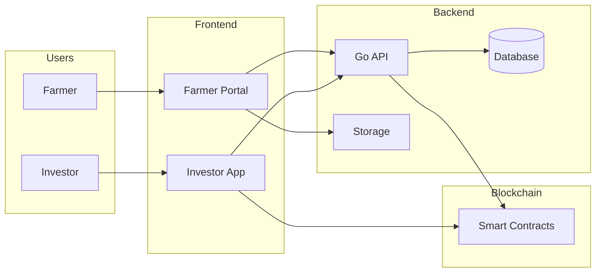
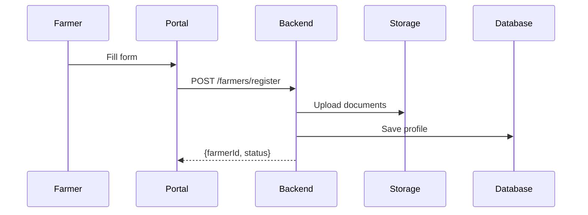
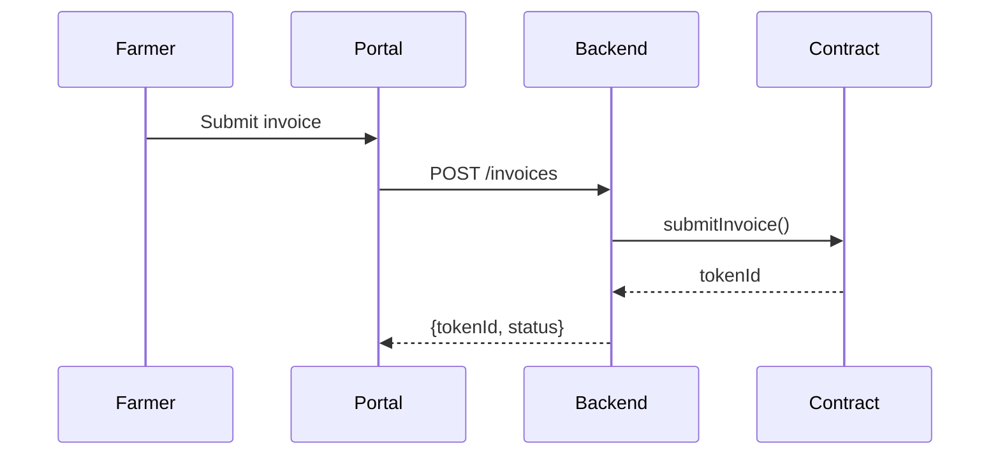
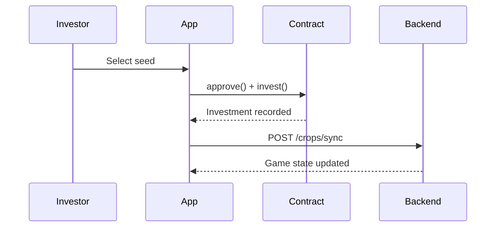
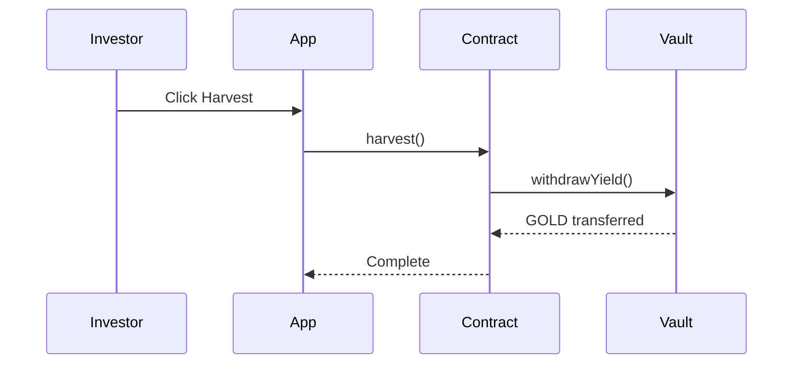
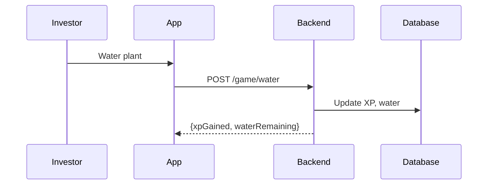
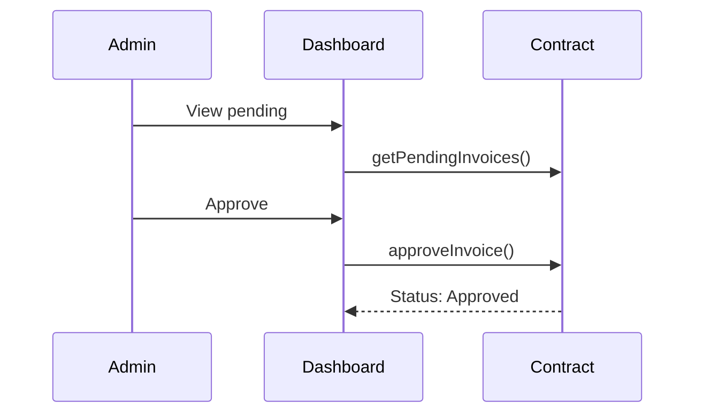

# System Flow

## Data Flow Architecture

---

## High-Level Flow

---

## Farmer Registration

| Location | Data                            |
| -------- | ------------------------------- |
| Database | Personal info, business details |
| Storage  | KTP, NPWP, bank statement       |

---

## Invoice Submission

---

## Investment Flow

---

## Harvest Flow

---

## Game Engagement

| Data  | Storage  | Updates         |
| ----- | -------- | --------------- |
| XP    | Database | Per interaction |
| Level | Database | On threshold    |
| Water | Database | Daily regen     |

---

## Admin Approval

---

## Layer Responsibilities

| Layer      | Handles             | Does Not Handle        |
| ---------- | ------------------- | ---------------------- |
| Frontend   | UI, wallet, caching | Business logic         |
| Backend    | Auth, game, files   | Financial transactions |
| Blockchain | Financial state     | User metadata          |

---

[Next: API Integration](api-integration.md)
