# System Flow

## Complete Data Flow Architecture

This page documents how data flows between the three main layers: Frontend, Backend, and Smart Contracts.

---

## High-Level Flow

```mermaid
graph LR
    subgraph Users
        F[👨‍🌾 Farmer]
        I[💰 Investor]
    end

    subgraph Frontend
        FE1[Farmer Portal]
        FE2[Investor App]
    end

    subgraph Backend
        BE[API Server]
        DB[(Database)]
        S3[Storage]
    end

    subgraph Blockchain
        SC[Smart Contracts]
        MANTLE[Mantle Network]
    end

    F --> FE1
    I --> FE2

    FE1 --> BE
    FE2 --> BE
    FE2 --> SC

    BE --> DB
    BE --> S3
    BE --> SC

    SC --> MANTLE
```



---

## Farmer Registration Flow

```mermaid
sequenceDiagram
    participant F as 👨‍🌾 Farmer
    participant FE as Farmer Portal
    participant BE as Backend API
    participant DB as Database
    participant R2 as Cloudflare R2

    F->>FE: 1. Fill registration form
    FE->>BE: 2. POST /api/farmers/register

    BE->>R2: 3. Upload KYC documents
    R2-->>BE: 4. Return file URLs

    BE->>DB: 5. Save farmer profile
    DB-->>BE: 6. Return farmerId

    BE-->>FE: 7. {farmerId, status: "pending"}
    FE-->>F: 8. "Registration submitted!"
```



### Data Stored

| Location          | Data                                    |
| ----------------- | --------------------------------------- |
| **Database**      | Personal info, business details, status |
| **Cloudflare R2** | KTP, NPWP, bank statement, photos       |

---

## Invoice Submission Flow

```mermaid
sequenceDiagram
    participant F as 👨‍🌾 Farmer
    participant FE as Farmer Portal
    participant BE as Backend API
    participant SC as Smart Contract
    participant BC as Blockchain

    F->>FE: 1. Submit invoice details
    FE->>BE: 2. POST /api/invoices/submit

    BE->>SC: 3. submitInvoice()
    SC->>BC: 4. Transaction submitted
    BC-->>SC: 5. Transaction confirmed
    SC-->>BE: 6. Return tokenId

    BE-->>FE: 7. {tokenId, status: "pending"}
    FE-->>F: 8. "Invoice submitted for review"
```



### Invoice Data Flow

| Data              | Location   | Reason           |
| ----------------- | ---------- | ---------------- |
| Invoice terms     | Blockchain | Immutable record |
| Farm details      | Database   | Rich metadata    |
| Invoice documents | R2         | File storage     |

---

## Investment Flow

```mermaid
sequenceDiagram
    participant I as 💰 Investor
    participant FE as Investor App
    participant W as Wallet
    participant SC as Smart Contracts
    participant BE as Backend API

    I->>FE: 1. Browse shop, select seed
    FE->>SC: 2. Read: getAvailableInvoices()
    SC-->>FE: 3. Return invoice list

    I->>FE: 4. Click "Buy Seed"
    FE->>W: 5. Request approval
    W->>SC: 6. approve(nft, amount)
    SC-->>W: 7. Approved

    FE->>W: 8. Request investment
    W->>SC: 9. invest(tokenId, amount)
    SC-->>W: 10. Investment recorded

    FE->>BE: 11. POST /api/game/sync
    BE-->>FE: 12. Game state updated

    FE-->>I: 13. "Seed planted! 🌱"
```



### Investment Transaction

| Step | Action       | Gas Required   |
| ---- | ------------ | -------------- |
| 1    | Approve GOLD | Yes            |
| 2    | Invest       | Yes            |
| 3    | NFT Minted   | Included in #2 |

---

## Harvest Flow

```mermaid
sequenceDiagram
    participant I as 💰 Investor
    participant FE as Investor App
    participant SC as Smart Contract
    participant V as Vault
    participant BE as Backend API

    I->>FE: 1. Check crop status
    FE->>SC: 2. Read: getInvestment()
    SC-->>FE: 3. {maturity: ready, claimed: false}

    I->>FE: 4. Click "Harvest"
    FE->>SC: 5. harvest(investmentId)

    SC->>V: 6. withdrawYield()
    V-->>SC: 7. GOLD transferred
    SC-->>FE: 8. Harvest complete

    FE->>BE: 9. POST /api/game/harvest
    BE-->>FE: 10. XP added, stats updated

    FE-->>I: 11. "Harvested 1,150 GOLD! 🌾"
```



### Harvest Calculation

```
Principal: 1,000 GOLD
Yield (15%): 150 GOLD
Total Return: 1,150 GOLD
```

---

## Game Engagement Flow

```mermaid
sequenceDiagram
    participant I as 💰 Investor
    participant FE as Investor App
    participant BE as Backend API
    participant DB as Database

    I->>FE: 1. Open app
    FE->>BE: 2. GET /api/user/profile
    BE->>DB: 3. Query user stats
    DB-->>BE: 4. {xp, level, water}
    BE-->>FE: 5. Return profile

    I->>FE: 6. Click "Water Plant"
    FE->>BE: 7. POST /api/game/water
    BE->>DB: 8. Update water, add XP
    DB-->>BE: 9. New stats
    BE-->>FE: 10. {waterRemaining, xpGained}

    FE-->>I: 11. "+10 XP! 💧"
```



### Game State (Off-Chain)

| Data          | Storage  | Updates            |
| ------------- | -------- | ------------------ |
| XP            | Database | Per interaction    |
| Level         | Database | On threshold       |
| Water Points  | Database | Daily regeneration |
| Daily Rewards | Database | 24h cooldown       |

---

## Admin Approval Flow

```mermaid
sequenceDiagram
    participant A as 👨‍💼 Admin
    participant AD as Admin Dashboard
    participant BE as Backend
    participant SC as Smart Contract

    A->>AD: 1. View pending invoices
    AD->>SC: 2. getPendingInvoices()
    SC-->>AD: 3. Return pending list

    A->>AD: 4. Review invoice details
    AD->>BE: 5. GET /api/admin/invoice/:id
    BE-->>AD: 6. Full invoice + farm data

    A->>AD: 7. Click "Approve"
    AD->>SC: 8. approveInvoice(tokenId)
    SC-->>AD: 9. Status: APPROVED

    AD-->>A: 10. "Invoice approved ✅"
```



---

## Layer Responsibilities Summary

| Layer          | Handles                         | Doesn't Handle                   |
| -------------- | ------------------------------- | -------------------------------- |
| **Frontend**   | UI, wallet interaction, caching | Business logic, data persistence |
| **Backend**    | Auth, game logic, file storage  | Financial transactions           |
| **Blockchain** | Financial state, immutability   | User metadata, files             |

---

## Next: [API Integration →](api-integration.md)
