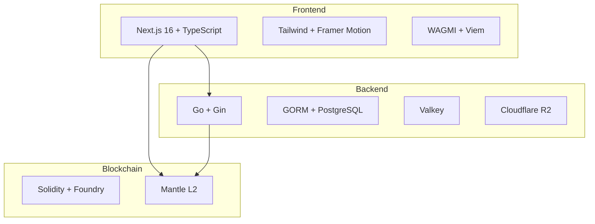

# Tech Stack

## Technology Overview

---

## Architecture



---

## Frontend

### Core

| Technology | Version | Purpose         |
| ---------- | ------- | --------------- |
| Next.js    | 16.x    | React framework |
| React      | 19.x    | UI library      |
| TypeScript | 5.x     | Type safety     |

### Styling

| Technology    | Purpose               |
| ------------- | --------------------- |
| Tailwind CSS  | Utility-first CSS     |
| Radix UI      | Accessible components |
| Framer Motion | Animations            |
| Lucide React  | Icons                 |

### Web3

| Technology     | Purpose                    |
| -------------- | -------------------------- |
| WAGMI          | React Ethereum hooks       |
| Viem           | TypeScript Ethereum client |
| Privy          | Social login + wallet      |
| TanStack Query | Data fetching              |

### State

| Technology      | Purpose           |
| --------------- | ----------------- |
| Zustand         | State management  |
| React Hook Form | Form handling     |
| Zod             | Schema validation |

---

## Backend

### Core

| Technology | Version | Purpose        |
| ---------- | ------- | -------------- |
| Go         | 1.22+   | Language       |
| Gin        | 1.x     | HTTP framework |
| GORM       | 2.x     | ORM            |

### Data

| Technology    | Purpose           |
| ------------- | ----------------- |
| PostgreSQL    | Primary database  |
| Valkey        | Caching, sessions |
| Cloudflare R2 | Object storage    |

### Blockchain

| Technology   | Purpose              |
| ------------ | -------------------- |
| go-ethereum  | Ethereum client      |
| ABI Bindings | Contract interaction |

---

## Blockchain

### Development

| Technology   | Purpose                     |
| ------------ | --------------------------- |
| Foundry      | Development framework       |
| Solidity     | Contract language (^0.8.24) |
| OpenZeppelin | Audited libraries           |

### Standards

| Standard      | Implementation   |
| ------------- | ---------------- |
| ERC-20        | GoldToken        |
| ERC-1155      | OwnaFarmNFT      |
| AccessControl | Role permissions |

### Network

| Property     | Value                |
| ------------ | -------------------- |
| Network      | Mantle Sepolia       |
| Type         | L2 Optimistic Rollup |
| Chain ID     | 5003                 |
| Native Token | MNT                  |

---

## Development Tools

### Frontend

```bash
pnpm              # Package manager
next build        # Production build
turbopack         # Dev server
eslint            # Linting
```

### Backend

```bash
go build          # Compile
go test           # Testing
air               # Hot reload
```

### Contracts

```bash
forge build       # Compile
forge test        # Testing
forge script      # Deploy
forge verify-contract  # Verify
```

---

## Infrastructure

| Layer    | Platform             |
| -------- | -------------------- |
| Frontend | Vercel               |
| Backend  | Docker / Cloud Run   |
| Database | Cloud SQL / Supabase |
| Storage  | Cloudflare R2        |

---

## Security

| Layer     | Measures                      |
| --------- | ----------------------------- |
| Frontend  | CSP headers, input validation |
| Backend   | JWT auth, rate limiting, CORS |
| Contracts | OpenZeppelin, access control  |
| Infra     | SSL/TLS, secrets management   |

---

[Next: System Flow](system-flow.md)
